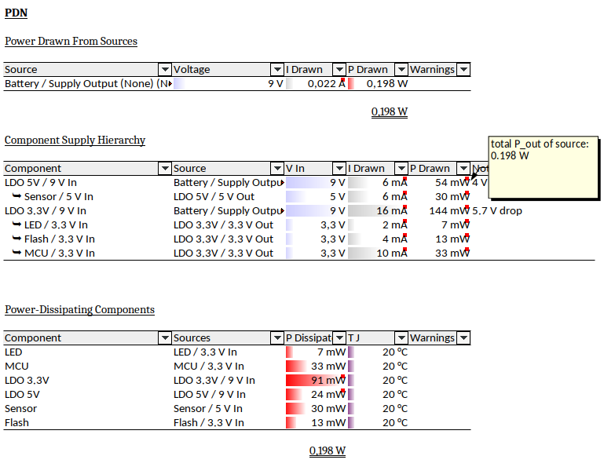
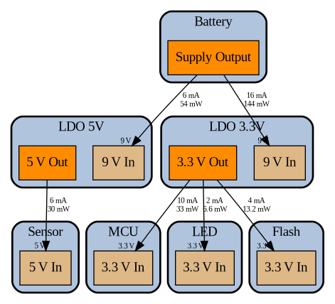

PDN Viz
=======

PDN Viz is a tool to calculate and visually represent power distribution networks (PDNs) via python.

What Is PDN Viz?
----------------

Normally you would just hack the PDN into a spreadsheet. But then the problems start:
- Spreadsheets are easy to mess up (data and formulas are mixed)
- Many components are more complex than nominal V and I
- It is easy to lose focus on a complex network

So instead, this tool allows you to enter the PDN via python, which in turn generates the spreadsheet for you, as well as a visual representation. You can define and re-use components, e.g. LDOs.

  

### Limitations

Some cases that cannot be covered by this tool:
- significant voltage drop across a wire
- significant differences between nominal and maximal current (which could make your PDN only sutiable for certain load conditions)
- converters with multiple inputs and multiple ouptuts

In such cases, you probably want to consult a circuit simulator, or linear equation solver.

If your problem is just varying load conditions, this tool might still help you when you create multiple outputs for different load conditions, which should be easy in Python. There is an example in the `samples` folder.

Dependencies
------------

- Tested with Python 3.11
    - Should work with 3.7 or newer (not tested)
- Packets: `scipy, graphviz, openpyxl`

How To Get Started
------------------

Just check out the examples in the `samples` folder.

Missing Features
----------------

- add a table of converters within a group, so you can see the total drawn I/P of the converter, even if some of it leaves the group
- minimum drawn current (e.g. for supplies or converters that become unstable otherwise)
- SI-formatted numbers in the spreadsheet
